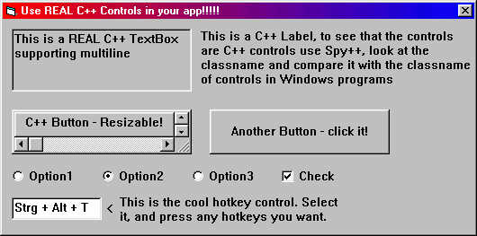



## C\+\+ Controls in your app \(updated\) \- now with tutorial

### Description

REAL C++ CONTROLS IN YOUR APP!!!

Do you know the code "Real C++ Buttons" by Randy Mcdowell?

It sends a message to a VB Button to make it a "C++ Button". But if you look at this button with

Spy++ you will see that it is still a "ThunderCommandButton", the VB Button.

My code lets you use EVERY C++ control in your app!!! And these controls are REAL C++ controls!!!

Think of the fantastic controls you can have: e.g. the cool hotkey control. Or what about a "real"

RICHEDIT control? The only limitation is your fantasy! Control events are also supported.

Well commented, and easy to use even if you don't understand everything that happens.

The second version of this code, now with tutorial and some new stuff.

Have fun with this code, use it in your app, and if you like it VOTE FOR IT!!!
 
### More Info
 

             |
---                |---
**Submitted On**   |2000-09-19 22:10:26
**By**             |[Druid Developing](https://github.com/Planet-Source-Code/PSCIndex/blob/master/ByAuthor/druid-developing.md)
**Level**          |Advanced
**User Rating**    |4.6 (37 globes from 8 users)
**Compatibility**  |VB 5\.0, VB 6\.0
**Category**       |[Custom Controls/ Forms/  Menus](https://github.com/Planet-Source-Code/PSCIndex/blob/master/ByCategory/custom-controls-forms-menus__1-4.md)
**World**          |[Visual Basic](https://github.com/Planet-Source-Code/PSCIndex/blob/master/ByWorld/visual-basic.md)
**Archive File**   |[CODE\_UPLOAD99959192000\.zip](https://github.com/Planet-Source-Code/druid-developing-c-controls-in-your-app-updated-now-with-tutorial__1-11554/archive/master.zip)

### Source Code

<html>
<head>
<meta http-equiv="Content-Language" content="de">
<meta http-equiv="Content-Type" content="text/html; charset=windows-1252">
<meta name="GENERATOR" content="Microsoft FrontPage 4.0">
<meta name="ProgId" content="FrontPage.Editor.Document">
<title>Neue Seite 1</title>
<meta name="Microsoft Theme" content="none, default">
</head>
<body>

(best viewed in 1024 x 768)

C++
Controls in your app - Now with tutorial

Hi, this is the update to my
code &quot;Real C++ Controls in your app&quot; which I submitted at the
beginning of September.

Now somebody posted that this
code isn´t explained well and so I wrote this tutorial.

If there would still be any
problems just <b> E-Mail</b> me at

<a href="mailto:druid-developing@gmx.de">druid-developing@gmx.de</a>

<b>Important note: This tutorial
is also included in the .zip file. You don´t have to read it here.</b>

&nbsp;

1. How to use
this code in your app

First you have to include
the modMain.bas in your project.

Then goto the menu &quot;Project&quot;
and click &quot;Properties of ...&quot;.

In this window set the
Start Object to &quot;Sub Main&quot;.

In the Sub Main which is
in the modMain you can now create the controls.

Call the function like
this:

&nbsp;

<b>Hwnd of the
control = CreateControl( &quot;Edit&quot; (Classname) , &quot;This is a TextBox&quot;
(Text) , 3 (Left) , 3 (Top) , 100 (Width) , 50 (Height) , (Optional Style) )</b>

&nbsp;

That´s it! No difficult API Calls, not
much code, just ONE FUNCTION!

Very easy to use, even
for beginners.

&nbsp;

2. How to
interact with the controls

If you want to use the
controls like normal controls, with Events and Properties it is a bit more
difficult.

For&nbsp; every Property
and Event you firs need the WindowHandle of the control.

You get it from the
CreateControl function (look above).

If you want to get e.g.
the Text of a created TextBox control you can do it like this:

&nbsp;

<b>'Declare
Variable to save the WindowHandle</b>

<b>Public TextBoxHwnd as Long</b>

<b>'Create the
TextBox</b>

<b>TextBoxHwnd =
CreateControl( &quot;Edit&quot; , &quot;Text to get&quot; ,&nbsp; 3 , 3 , 100 ,
40 )</b>

&nbsp;

Using this Function you
can get the actual Text of the TextBox

<b>Function
Get_Text_Of_Control(ByVal cHwnd as Long) as String</b>

<b>Dim
ControlText As String</b>

<b>ControlText = Space(254)</b>

<b>'Use the GetWindowText API to get the actual
text of the TextBox control</b>

<b>    GetWindowText
c</b><b>Hwnd </b><b>,
ControlText , 254</b>

<b>Get_Text_Of_Control</b><b>
= Trim(</b><b>ControlText</b><b>)</b>

<b>End Function</b>

&nbsp;

Use this function like
this:

<b>TextBoxText =
Get_Text_Of_Control(TextBoxHwnd)</b>

<b>MsgBox
TextBoxText</b>

&nbsp;

To use an Event, e.g. the click Event of
a Button you can do it like this:

&nbsp;

<b>'Declare
Variable to save the WindowHandle</b>

<b>Public ButtonHwnd as Long</b>

<b> 'To save the old WindowProcedure for the button</b>

<b>Public gButOldProc as Long</b>

&nbsp;

<b>'Create the
Button</b>

<b>ButtonHwnd </b><b>=
CreateControl( &quot;Button&quot; , &quot;Click this button&quot; ,&nbsp; 3 , 3
, 100 , 40 )</b>

<b>  'Get the address of the standard button procedure and save it in
&quot;gButOldProc&quot;</b>

<b>gButOldProc&amp; = GetWindowLong(ButtonHwnd&amp;,
GWL_WNDPROC)</b>

<b>'Use GWL_WNDPROC to save the adress of the procedure for the
button</b>

<b>'You have to do this for every control you want to have a procedure</b>

<b>  Call SetWindowLong(ButtonHwnd&amp;, GWL_WNDPROC, GetAddress(AddressOf ButtonWndProc))</b>

&nbsp;

<b>'This is the procedure that is called when you click the button</b>

<b>Public Function ButtonWndProc(ByVal hwnd As Long, ByVal uMsg As Long, ByVal wParam As Long, ByVal lParam As Long) As Long</b>

<b>  Select Case uMsg&amp;</b>

<b>  Case WM_LBUTTONUP:</b>

<b>'Left button is up (user clicked the Button)</b>

<b>'Use
&quot;WM_LBUTTONDOWN&quot;</b>

<b>MsgBox
&quot;The button was clicked&quot;</b>

<b>'Call the standard window proc</b>

<b>  ButtonWndProc = CallWindowProc(gButOldProc&amp;, hwnd&amp;, uMsg&amp;, wParam&amp;, lParam&amp;)</b>

<b>End Function</b>

&nbsp;

3. Final
Explanations

The special thing on this
code is that you can use every registered Windows class name for a control.

You can also create an
own class name using the API &quot;RegisterWindowClass&quot;.

That´s all for today,
bye.

Maybe I update this code
once more.

<b>PS: Please excuse me
for my bad English, I´m German.</b>

<b>And PLEASE,
PLEASE, PLEASE VOTE FOR ME!!!</b>

</body>
</html>

